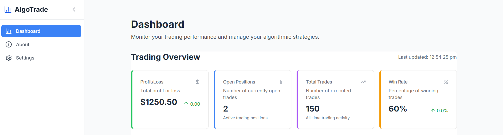

# AlgoTrade - Algorithmic Trading Platform

AlgoTrade is a modern, user-friendly algorithmic trading platform designed to provide traders with advanced tools for monitoring, analyzing, and optimizing their automated trading strategies.



## Features

- 📊 Real-time performance monitoring
- 📈 Comprehensive trading analytics
- 🔄 Customizable trading strategies
- 📉 Historical data analysis
- 🌐 Multi-exchange support
- 🛡️ Advanced risk management tools

## Tech Stack

- **Framework**: Next.js 14 with App Router
- **Language**: TypeScript
- **Styling**: Tailwind CSS
- **UI Components**: Custom components with shadcn/ui
- **Icons**: Lucide Icons
- **State Management**: React Context API

## Getting Started

### Prerequisites

- Node.js 18.0 or higher
- npm or yarn

### Installation

1. Clone the repository:
```bash
git clone https://github.com/PUSKAR-DJ/AlgoTrade.git
cd AlgoTrade
```

2. Install dependencies:
```bash
npm install
# or
yarn install
```

3. Run the development server:
```bash
npm run dev
# or
yarn dev
```

4. Open [http://localhost:9002](http://localhost:9002) in your browser.

## Project Structure

```
src/
├── app/                    # Next.js app router pages
│   ├── about/             # About page
│   ├── settings/          # Settings page
│   ├── layout.tsx         # Root layout
│   └── page.tsx           # Dashboard page
├── components/            # React components
│   ├── dashboard/         # Dashboard components
│   ├── layout/           # Layout components
│   └── ui/               # UI components
├── lib/                  # Utility functions
└── styles/               # Global styles
```

## Features in Detail

### Dashboard
- Real-time performance metrics
- Trading activity monitoring
- Strategy performance tracking
- Profit/loss visualization

### About
- Platform overview
- Key features
- How it works
- FAQ section

### Settings
- Account configuration
- Trading preferences
- API configuration
- Risk management settings

## Contributing

1. Fork the repository
2. Create your feature branch (`git checkout -b feature/amazing-feature`)
3. Commit your changes (`git commit -m 'Add some amazing feature'`)
4. Push to the branch (`git push origin feature/amazing-feature`)
5. Open a Pull Request

## License

This project is licensed under the MIT License - see the [LICENSE](LICENSE) file for details.

## Acknowledgments

- [Next.js](https://nextjs.org/)
- [Tailwind CSS](https://tailwindcss.com/)
- [Lucide Icons](https://lucide.dev/)
- [shadcn/ui](https://ui.shadcn.com/)

## Credits

This project has been made possible with the help of the following tools and services:

- **[Firebase Studio](https://firebase.studio)**: For providing excellent tools for app development and backend services.
- **[Cursor.ai](https://cursor.ai)**: For offering advanced AI capabilities that helped improve the efficiency and intelligence of the project.
- **[ChatGPT](https://chat.openai.com)**: For assisting with brainstorming, coding, and troubleshooting throughout the development process.

Thank you for the invaluable support!
